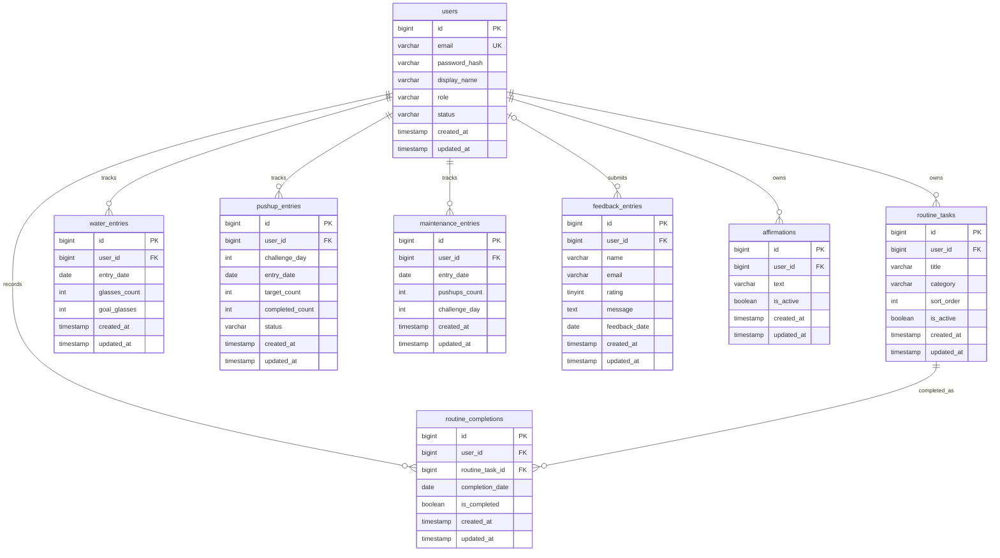

# MindMirror Database Schema

This document describes the Phase 2 database foundation implemented with Flyway migrations.

## ER Diagram

## Relationships

- `users` is the parent table for all user-owned habit and wellness data.
- `routine_tasks.user_id` references `users.id` and cascades on user deletion.
- `routine_completions.user_id` references `users.id` and cascades on user deletion.
- `routine_completions.routine_task_id` references `routine_tasks.id` and cascades on task deletion.
- `water_entries.user_id`, `pushup_entries.user_id`, `maintenance_entries.user_id`, and `affirmations.user_id` reference `users.id` and cascade on user deletion.
- `feedback_entries.user_id` is nullable and uses `ON DELETE SET NULL` so submitted feedback can remain after a user account is removed.

## Unique Constraints

- `users.email`
- `routine_tasks(user_id, title, category)`
- `routine_completions(routine_task_id, completion_date)`
- `water_entries(user_id, entry_date)`
- `pushup_entries(user_id, challenge_day)`
- `maintenance_entries(user_id, entry_date)`
- `affirmations(user_id, text)`

## Check Constraints

- `water_entries`: `glasses_count >= 0` and `goal_glasses > 0`
- `pushup_entries`: positive challenge day and non-negative target/completed counts
- `maintenance_entries`: positive pushup count and optional positive challenge day
- `feedback_entries`: rating from 1 to 5

## Indexes

- `user_id` indexes are present on all user-related child tables.
- `date` indexes are present on `completion_date`, `entry_date`, and `feedback_date`.
- `email` indexes are present through `users.email` unique constraint and `feedback_entries.email`.
- `created_at` indexes are present on every Phase 2 core table.

## Migrations

- `V1__initial_schema.sql`: existing project marker table.
- `V2__phase_2_core_schema.sql`: Phase 2 core schema, foreign keys, indexes, unique constraints, and check constraints.
- `V3__seed_development_data.sql`: development seed user and sample habit data.
