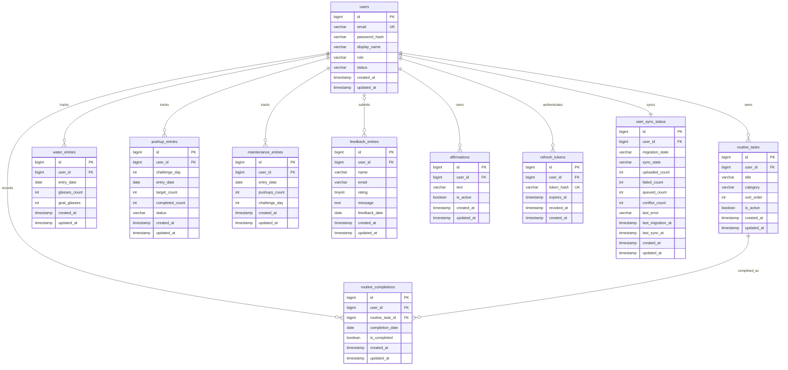

# MindMirror Database Schema

This document describes the database foundation implemented with Flyway migrations through Phase 8.5 authentication, migration, and sync integration.

## ER Diagram

```mermaid
erDiagram
    users ||--o{ routine_tasks : owns
    users ||--o{ routine_completions : records
    routine_tasks ||--o{ routine_completions : completed_as
    users ||--o{ water_entries : tracks
    users ||--o{ pushup_entries : tracks
    users ||--o{ maintenance_entries : tracks
    users |o--o{ feedback_entries : submits
    users ||--o{ affirmations : owns
    users ||--o{ refresh_tokens : authenticates
    users ||--|| user_sync_status : syncs

    users {
        bigint id PK
        varchar email UK
        varchar password_hash
        varchar display_name
        varchar role
        varchar status
        timestamp created_at
        timestamp updated_at
    }

    routine_tasks {
        bigint id PK
        bigint user_id FK
        varchar title
        varchar category
        int sort_order
        boolean is_active
        timestamp created_at
        timestamp updated_at
    }

    routine_completions {
        bigint id PK
        bigint user_id FK
        bigint routine_task_id FK
        date completion_date
        boolean is_completed
        timestamp created_at
        timestamp updated_at
    }

    water_entries {
        bigint id PK
        bigint user_id FK
        date entry_date
        int glasses_count
        int goal_glasses
        timestamp created_at
        timestamp updated_at
    }

    pushup_entries {
        bigint id PK
        bigint user_id FK
        int challenge_day
        date entry_date
        int target_count
        int completed_count
        varchar status
        timestamp created_at
        timestamp updated_at
    }

    maintenance_entries {
        bigint id PK
        bigint user_id FK
        date entry_date
        int pushups_count
        int challenge_day
        timestamp created_at
        timestamp updated_at
    }

    feedback_entries {
        bigint id PK
        bigint user_id FK
        varchar name
        varchar email
        tinyint rating
        text message
        date feedback_date
        timestamp created_at
        timestamp updated_at
    }

    affirmations {
        bigint id PK
        bigint user_id FK
        varchar text
        boolean is_active
        timestamp created_at
        timestamp updated_at
    }

    refresh_tokens {
        bigint id PK
        bigint user_id FK
        varchar token_hash UK
        timestamp expires_at
        timestamp revoked_at
        timestamp created_at
    }

    user_sync_status {
        bigint id PK
        bigint user_id FK
        varchar migration_state
        varchar sync_state
        int uploaded_count
        int failed_count
        int queued_count
        int conflict_count
        varchar last_error
        timestamp last_migration_at
        timestamp last_sync_at
        timestamp created_at
        timestamp updated_at
    }
```

## Relationships

- `users` is the parent table for all user-owned habit and wellness data.
- `routine_tasks.user_id` references `users.id` and cascades on user deletion.
- `routine_completions.user_id` references `users.id` and cascades on user deletion.
- `routine_completions.routine_task_id` references `routine_tasks.id` and cascades on task deletion.
- `water_entries.user_id`, `pushup_entries.user_id`, `maintenance_entries.user_id`, and `affirmations.user_id` reference `users.id` and cascade on user deletion.
- `feedback_entries.user_id` is nullable and uses `ON DELETE SET NULL` so submitted feedback can remain after a user account is removed.
- `refresh_tokens.user_id` references `users.id` and cascades on user deletion. Application-level account deletion marks users as `DELETED` and revokes refresh tokens.
- `user_sync_status.user_id` references `users.id` and cascades on user deletion.

## Unique Constraints

- `users.email`
- `routine_tasks(user_id, title, category)`
- `routine_completions(routine_task_id, completion_date)`
- `water_entries(user_id, entry_date)`
- `pushup_entries(user_id, challenge_day)`
- `maintenance_entries(user_id, entry_date)`
- `affirmations(user_id, text)`
- `refresh_tokens.token_hash`
- `user_sync_status.user_id`

## Check Constraints

- `water_entries`: `glasses_count >= 0` and `goal_glasses > 0`
- `pushup_entries`: positive challenge day and non-negative target/completed counts
- `maintenance_entries`: positive pushup count and optional positive challenge day
- `feedback_entries`: rating from 1 to 5

## Indexes

- `user_id` indexes are present on all user-related child tables.
- `date` indexes are present on `completion_date`, `entry_date`, and `feedback_date`.
- `email` indexes are present through `users.email` unique constraint and `feedback_entries.email`.
- `created_at` indexes are present on every Phase 2 core table.
- `refresh_tokens.user_id` and `refresh_tokens.expires_at` are indexed for token lifecycle operations.
- `user_sync_status.updated_at` is indexed for sync monitoring.

## Authentication Data

- `users.password_hash` stores BCrypt hashes.
- `users.role` stores role names such as `USER` and `ADMIN`.
- `users.status` stores lifecycle state such as `ACTIVE` and `DELETED`.
- `refresh_tokens.token_hash` stores SHA-256 hashes of opaque refresh tokens, not the raw token values.
- `refresh_tokens.revoked_at` is set when a token is used, logged out, expired by password change, or revoked during account deletion.

## Migration And Sync Data

- `user_sync_status` stores the latest migration and sync state for each user.
- `migration_state` tracks browser localStorage migration lifecycle values such as `NOT_STARTED`, `RUNNING`, `COMPLETE`, `PARTIAL`, `FAILED`, and `OFFLINE`.
- `sync_state` tracks the latest sync report from the frontend.
- `uploaded_count`, `failed_count`, `queued_count`, and `conflict_count` summarize the most recent sync.
- `last_error`, `last_migration_at`, and `last_sync_at` support sync error recovery and user-facing status displays.

## Feedback Data

- Feedback submissions are stored permanently in `feedback_entries`.
- `feedback_entries.user_id` is nullable so anonymous public submissions can be retained.
- Authenticated submissions are linked to the submitting user.
- `feedback_entries.rating` is constrained to values from 1 to 5.
- Feedback list APIs sort by `created_at` descending and use pagination.

## Routine Data

- Routine tasks are stored in `routine_tasks`.
- Each user can have one task per `title` and `category`.
- The backend seeds default `daily` and `holiday` tasks lazily for users who do not have them yet.
- Custom tasks default to the `custom` category.
- Task deletion is implemented as `is_active = false` so historical completions remain available.
- Daily task state is stored in `routine_completions`.
- Each task can have one completion record per `completion_date`.
- Routine history and CSV export are calculated from completion records grouped by date.

## Affirmation Data

- Affirmations are stored in `affirmations`.
- Each user can have one affirmation per `text`.
- Deleting an affirmation sets `is_active = false`.
- Re-adding the same affirmation text reactivates the existing row.

## Water Data

- Water intake is stored in `water_entries`.
- Each user can have one water record per `entry_date`.
- `glasses_count` stores the daily intake count and must be non-negative.
- `goal_glasses` stores the daily target and must be positive.
- Water history can be queried by date range and is returned newest first.
- Water streaks count consecutive days where `glasses_count >= goal_glasses`.

## Migrations

- `V1__initial_schema.sql`: existing project marker table.
- `V2__phase_2_core_schema.sql`: Phase 2 core schema, foreign keys, indexes, unique constraints, and check constraints.
- `V3__seed_development_data.sql`: development seed user and sample habit data.
- `V4__auth_refresh_tokens.sql`: Phase 3 refresh token storage for JWT authentication.
- `V5__sync_status.sql`: Phase 8.5 per-user migration and sync status.
